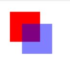
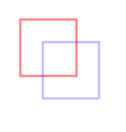
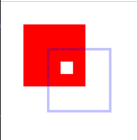
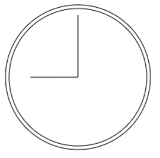
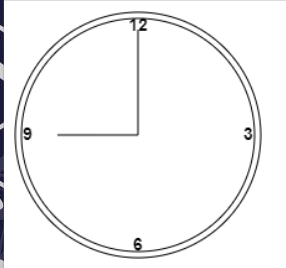

# Canvas_learning

该系列是canvas的练手项目，利用canvas完成简单的图形绘制(矩形等基本图形)->简单的实例(时钟等图形)->小游戏(五子棋，flappy bird)/海报绘制等基本的场景。

该项目的背景是帮助canvas的初学者在初学canvas过程中可以通过实际的案例快速上手并进一步开发出更有趣的项目！

## Canvas基础知识

关于canvas的基础知识大家应该都有一定的了解，这里不加赘述，想学习的同学可以参考

* 《JavaScript高级程序设计(第4版)》第18章 动画与Canvas图形
* 掘金上的优秀文章 《[案例+图解带你一文读懂canvas](https://juejin.cn/post/7119495608938790942)》《[Canvas从入门到劝朋友放弃》](https://juejin.cn/post/7116784455561248775)

## Chapter1 Canvas简单图形绘制

Chapter1主要根据《Javascript高级程序设计(第4版)》对于Canvas相关章节的描述来完成一些小效果Demo,  主要帮助大家快速了解Canvas一些基本API的用法。

### 填充描边与绘制矩形

熟悉 ``fillStyle``, ``strokeStyle``等对于填充和描边全局设置的属性，熟悉 ``fillRect()``, ``strokeRect()``和 ``clearRect()``绘制矩形API的相关使用，具体的效果见下方，大家也可以参考相关代码:







### 绘制路径

对于复杂的形状和线条，2D上下文支持我们通过在画布上绘制路径来完成。绘制路径主要用到以下的API：

创建路径

* beginPath(): 开始绘制新路径
* arc(x, y, radius, startAngle, endAngle, counterclockwise): 以坐标(x,y)为圆心，以radius为弧线绘制圆，startAngel,endAngle是起始和结束弧度,counterclockwise控制顺时针还是逆时针，默认是顺时针
* arcTo(x1, y1, x2, y2, radius): 以给定半径radius, 绘制从上一点经(x1,y1)到(x2,y2)的弧线
* bezierCurveTo(c1x, c1y, c2x, c2y, x, y): 以(c1x, c1y)和(c2x, c2y)为控制点, 绘制从上一点到(x,y)的弧线(三次贝塞尔曲线)
* lineTo(x, y): 绘制一条从上一点到(x,y)的直线
* moveTo(x,y): 不绘制线条，只把光标移动到(x,y)
* quadraticCurveTo(cx, cy, x, y): 以(cx, cy)为控制点，绘制一条从上一点到(x,y)的弧线(二次贝塞尔弧线)
* rect(x,y, width, height): 以给定的宽度和高度在坐标(x,y)绘制一条, 仅是绘制路径不会创造图形

关闭路径

* closePath(): 使用该api绘制一条返回起点的线
* fill(): 填充路径， 在路径完成后使用fill()填充路径， 可设置fillStyle属性
* stroke(): 描画路径, 在路径完成后使用stroke()描画路径， 可设置strokeStyle属性
* clip(): 基于已有的路径创建一个剪切区域（绘制的东西只会在剪切区域中进行展示)

上面需要注意的api有开始绘制的 ``beginPath()``, 结束绘制后要调用 ``closePath()``作用是控制绘制一条返回起点的线， 同时注意还有一个api ``isPointInPath(x, y)`` 在调用 ``closePath()`` 前来判断一个点坐标(x,y)是否在当前绘制的路径上。

本小节利用以上的api绘制一个带有时针和分针的表, 具体的代码可参考相应内容:



### 绘制文本

文本的绘制也是常见的绘制需求，2D上下文也提供了很多绘制文本的方法：

绘制文本常用的api

* fillText(string, x, y): 一般我们用这个方法来绘制文本，同时可以设置fillStyle属性调整颜色

常用的字体配置项

* font: 用CSS语法指定字体样式，大小和字体族等, context.font = 'bold 14px Arial'
* textAlign: 指定文本的对齐方式, start, end和center可选
* textBaseLine: 指定文本的对齐基线，可能的值包括"top", "hanging", "middle", "alphabetic", "bottom"等

注意: ``fillText``还有第四个参数, 即文本的最大宽度， 这个参数是可选的，当我们要绘制的文字超过了这个最大宽度后，文字会以正确的字符高度绘制，但水平会被压缩，这会导致失真。 2D上下文还有一个常用的api是 ``mearsueText()``, 这可以计算出文字的宽度（和项目中使用的@antv/G计算文本大小的原理类似), 用法如下:

```javascript
//想把hello world! 放到一个140像素宽的矩形中
let fontSize = 100;
context.font = fontSize + 'px Arial';
while(contex.mearsueText('hello world!').width > 140){
  fontSize--;
  context.font = fontSize + 'px Arial';
}
context.fillText('Hello World!', 10, 10);
```


